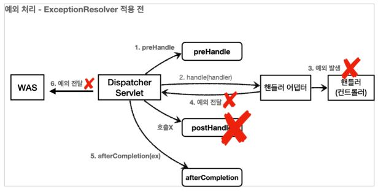
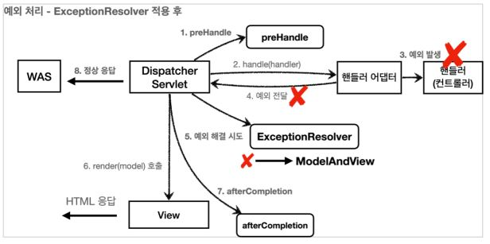
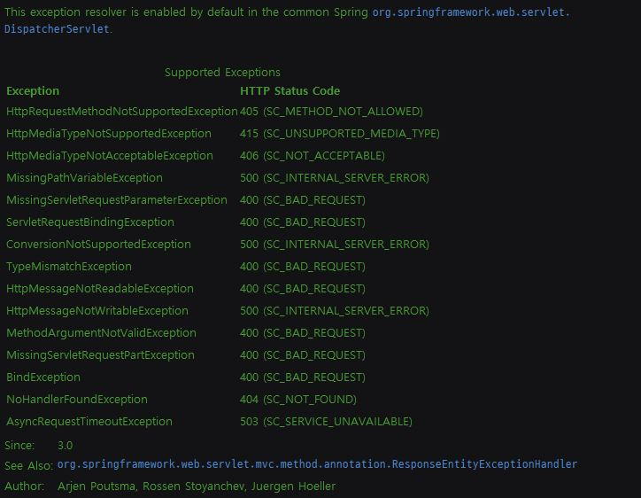

# API 예외 처리

HTML 페이지의 경우 지금까지 설명했던 것 처럼 4xx, 5xx와 같은 오류 페이지만 있으면 대부분의 문제를
해결할 수 있다.
그런데 API의 경우에는 생각할 내용이 더 많다. 오류 페이지는 단순히 고객에게 오류 화면을 보여주고
끝이지만, __API는 각 오류 상황에 맞는 오류 응답 스펙을 정하고, JSON으로 데이터를 내려주어야 한다.__

- ErrorPageController - API 응답 추가

```java
@RequestMapping(value = "/error-page/500", produces = MediaType.APPLICATION_JSON_VALUE)
public ResponseEntity<Map<String, Object>> errorPage500Api(
        HttpServletRequest request, HttpServletResponse response) {

    log.info("API errorPage 500");

    Map<String, Object> result = new HashMap<>();
    Exception ex = (Exception) request.getAttribute(ERROR_EXCEPTION);
    result.put("status", request.getAttribute(ERROR_STATUS_CODE));
    result.put("message", ex.getMessage());

    Integer statusCode = (Integer) request.getAttribute(RequestDispatcher.ERROR_STATUS_CODE);
    return new ResponseEntity<>(result, HttpStatus.valueOf(statusCode));
}
```

`produces = MediaType.APPLICATION_JSON_VALUE` 의 뜻은 클라이언트가 요청하는 HTTP Header 의 `Accept` 값이 `application/json` 일 때 해당 메서드가 호출된다는 것이다.
결국 클라이언트가 받고 싶은 미디어 타입이 json 이면 이 컨트롤러의 메서드가 호출된다.

응답 데이터를 위해서 Map 을 만들고 status , message 키에 값을 할당했다. Jackson 라이브러리는
Map 을 JSON 구조로 변환할 수 있다.
ResponseEntity 를 사용해서 응답하기 때문에 메시지 컨버터가 동작하면서 클라이언트에 JSON이
반환된다.

포스트맨을 통해서 다시 테스트 해보자. HTTP Header에 Accept 가 application/json 인 것을 꼭 확인하자.

```
{
 "message": "잘못된 사용자",
 "status": 500
}
```

## API 예외 처리 - 스프링 부트 기본 오류 처리

API 예외 처리도 스프링 부트가 제공하는 기본 오류 방식을 사용할 수 있다.
스프링 부트가 제공하는 BasicErrorController 코드를 보자.

```java
@RequestMapping(produces = MediaType.TEXT_HTML_VALUE)
public ModelAndView errorHtml(HttpServletRequest request, HttpServletResponse response) {}

@RequestMapping
public ResponseEntity<Map<String, Object>> error(HttpServletRequest request) {}
```

/error 동일한 경로를 처리하는 errorHtml() , error() 두 메서드를 확인할 수 있다.

- errorHtml() : produces = MediaType.TEXT_HTML_VALUE : 클라이언트 요청의 Accept 해더 값이
text/html 인 경우에는 errorHtml() 을 호출해서 view를 제공한다.
- error() : 그외 경우에 호출되고 ResponseEntity 로 HTTP Body에 JSON 데이터를 반환한다.

### Html 페이지 vs API 오류

BasicErrorController 를 확장하면 JSON 메시지도 변경할 수 있다. 그런데 API 오류는 조금 뒤에
설명할 @ExceptionHandler 가 제공하는 기능을 사용하는 것이 더 나은 방법이므로 지금은
BasicErrorController 를 확장해서 JSON 오류 메시지를 변경할 수 있다 정도로만 이해해두자.

스프링 부트가 제공하는 BasicErrorController 는 HTML 페이지를 제공하는 경우에는 매우 편리하다. 
4xx, 5xx 등등 모두 잘 처리해준다. 그런데 API 오류 처리는 다른 차원의 이야기이다. __API 마다, 각각의
컨트롤러나 예외마다 서로 다른 응답 결과를 출력해야 할 수도 있다.__

예를 들어서 회원과 관련된 API 에서 예외가 발생할 때 응답과, 상품과 관련된 API 에서 발생하는 예외에 따라 그 결과가 달라질 수 있다. 
결과적으로 매우 세밀하고 복잡하다. 따라서 이 방법은 HTML 화면을 처리할 때 사용하고, API는 오류
처리는 뒤에서 설명할 @ExceptionHandler 를 사용하자.

## API 예외 처리 - HandlerExceptionResolver 시작

- 목표
  - 예외가 발생해서 서블릿을 넘어 WAS까지 예외가 전달되면 HTTP 상태코드가 500으로 처리된다. 
  - 발생하는 예외에 따라서 400, 404 등등 다른 상태코드도 처리하고 싶다.
  - 오류 메시지, 형식등을 API 마다 다르게 처리하고 싶다.

### HandlerExceptionResolver

스프링 MVC는 컨트롤러(핸들러) 밖으로 예외가 던져진 경우 예외를 해결하고, 동작을 새로 정의할 수 있는
방법을 제공한다. 컨트롤러 밖으로 던져진 예외를 해결하고, 동작 방식을 변경하고 싶으면
`HandlerExceptionResolver` 를 사용하면 된다. 줄여서 `ExceptionResolver` 라 한다.





> ExceptionResolver 로 예외를 해결해도 postHandle() 은 호출되지 않는다.

- HandlerExceptionResolver Interface

```java
public interface HandlerExceptionResolver {

	/**
	 * Try to resolve the given exception that got thrown during handler execution,
	 * returning a {@link ModelAndView} that represents a specific error page if appropriate.
	 * <p>The returned {@code ModelAndView} may be {@linkplain ModelAndView#isEmpty() empty}
	 * to indicate that the exception has been resolved successfully but that no view
	 * should be rendered, for instance by setting a status code.
	 * @param request current HTTP request
	 * @param response current HTTP response
	 * @param handler the executed handler, or {@code null} if none chosen at the
	 * time of the exception (for example, if multipart resolution failed)
	 * @param ex the exception that got thrown during handler execution
	 * @return a corresponding {@code ModelAndView} to forward to,
	 * or {@code null} for default processing in the resolution chain
	 */
	@Nullable
	ModelAndView resolveException(
			HttpServletRequest request, HttpServletResponse response, @Nullable Object handler, Exception ex);

}
```

- handler : 핸들러(컨트롤러) 정보
- Exception ex : 핸들러(컨트롤러)에서 발생한 발생한 예외

#### MyHandlerExceptionResolver

```java
@Slf4j
public class MyHandlerExceptionResolver implements HandlerExceptionResolver {

    @Override
    public ModelAndView resolveException(HttpServletRequest request, HttpServletResponse response, Object handler, Exception ex) {

        log.info("call resolver", ex);

        try {
            if (ex instanceof IllegalArgumentException) {
                log.info("IllegalArgumentException resolver to 400");
                response.sendError(HttpServletResponse.SC_BAD_REQUEST, ex.getMessage());
                return new ModelAndView();
            }

        } catch (IOException e) {
            log.error("resolver ex", e);
        }

        return null;
    }
}
```

- ExceptionResolver 가 ModelAndView 를 반환하는 이유는 마치 try, catch를 하듯이, Exception 을
처리해서 정상 흐름 처럼 변경하는 것이 목적이다. 이름 그대로 Exception 을 Resolver(해결)하는 것이
목적이다.
- 여기서는 IllegalArgumentException 이 발생하면 response.sendError(400) 를 호출해서 HTTP 상태 코드를 400으로 지정하고, 빈 ModelAndView 를 반환한다.

- __반환 값에 따른 동작 방식__
  - HandlerExceptionResolver 의 반환 값에 따른 DispatcherServlet 의 동작 방식은 다음과 같다.
  - `빈 ModelAndView`: new ModelAndView() 처럼 빈 ModelAndView 를 반환하면 뷰를 렌더링 하지 않고, 정상 흐름으로 서블릿이 리턴된다.
  - `ModelAndView 지정`: ModelAndView 에 View, Model 등의 정보를 지정해서 반환하면 뷰를 렌더링 한다.
  - `null`: null 을 반환하면, 다음 ExceptionResolver 를 찾아서 실행한다. 만약 처리할 수 있는 ExceptionResolver 가 없으면 예외 처리가 안되고, 기존에 발생한 예외를 서블릿 밖으로 던진다.

#### ExceptionResolver 활용

- __예외 상태 코드 변환__
  - 예외를 response.sendError(xxx) 호출로 변경해서 서블릿에서 상태 코드에 따른 오류를 처리하도록 위임
  - 이후 WAS 는 서블릿 오류 페이지를 찾아서 내부 호출, 예를 들어서 스프링 부트가 기본으로 설정한 /error 가 호출됨
- __뷰 템플릿 처리__
  - ModelAndView 에 값을 채워서 예외에 따른 새로운 오류 화면 뷰 렌더링 해서 고객에게 제공
- __API 응답 처리__
  - response.getWriter().println("hello"); 처럼 HTTP 응답 바디에 직접 데이터를 넣어주는 것도 가능하다. 여기에 JSON 으로 응답하면 API 응답 처리를 할 수 있다.

#### WebConfig

```java
@Override
public void extendHandlerExceptionResolvers(List<HandlerExceptionResolver> resolvers) {
        resolvers.add(new MyHandlerExceptionResolver());
        resolvers.add(new UserHandlerExceptionResolver());
}
```

> configureHandlerExceptionResolvers(..) 를 사용하면 스프링이 기본으로 등록하는
ExceptionResolver 가 제거되므로 주의, extendHandlerExceptionResolvers 를 사용하자.

## ## API 예외 처리 - HandlerExceptionResolver 활용

예외가 발생하면 WAS까지 예외가 던져지고, WAS에서 오류 페이지 정보를 찾아서 다시 /error 를
호출하는 과정은 생각해보면 너무 복잡하다. ExceptionResolver 를 활용하면 예외가 발생했을 때 이런
복잡한 과정 없이 여기에서 문제를 깔끔하게 해결할 수 있다.

즉, `ExceptionResolver` 를 사용하면 컨트롤러에서 예외가 발생해도 ExceptionResolver 에서 예외를
처리해버린다. 따라서 예외가 발생해도 서블릿 컨테이너까지 예외가 전달되지 않고, 스프링 MVC에서 예외 처리는 끝이
난다.

결과적으로 WAS 입장에서는 정상 처리가 된 것이다. 이렇게 예외를 이곳에서 모두 처리할 수 있다는 것이
핵심이다.

서블릿 컨테이너까지 예외가 올라가면 복잡하고 지저분하게 추가 프로세스가 실행된다. 반면에
ExceptionResolver 를 사용하면 예외처리가 상당히 깔끔해진다.

- 사용자 정의 예외 추가

```java
public class UserException extends RuntimeException {

    public UserException() {
        super();
    }

    public UserException(String message) {
        super(message);
    }

    public UserException(String message, Throwable cause) {
        super(message, cause);
    }

    public UserException(Throwable cause) {
        super(cause);
    }

    protected UserException(String message, Throwable cause, boolean enableSuppression, boolean writableStackTrace) {
        super(message, cause, enableSuppression, writableStackTrace);
    }
}
```
```java
@Slf4j
@RestController
public class ApiExceptionController {

    @GetMapping("/api/members/{id}")
    public MemberDto getMember(@PathVariable("id") String id) {

        if (id.equals("ex")) {
            throw new RuntimeException("잘못된 사용자");
        }
        if (id.equals("bad")) {
            throw new IllegalArgumentException("잘못된 입력 값");
        }
        if (id.equals("user-ex")) {
            throw new UserException("사용자 오류");
        }

        return new MemberDto(id, "hello " + id);
    }

    @GetMapping("/api/response-status-ex1")
    public String responseStatusEx1() {
        throw new BadRequestException();
    }

    @GetMapping("/api/response-status-ex2")
    public String responseStatusEx2() {
        throw new ResponseStatusException(HttpStatus.NOT_FOUND, "error.bad", new IllegalArgumentException());
    }

    @GetMapping("/api/default-handler-ex")
    public String defaultException(@RequestParam Integer data) {
        return "ok";
    }


    @Data
    @AllArgsConstructor
    static class MemberDto {
        private String memberId;
        private String name;
    }

}
```
```java
@Slf4j
public class UserHandlerExceptionResolver implements HandlerExceptionResolver {

    private final ObjectMapper objectMapper = new ObjectMapper();

    @Override
    public ModelAndView resolveException(HttpServletRequest request, HttpServletResponse response, Object handler, Exception ex) {

        try {

            if (ex instanceof UserException) {
                log.info("UserException resolver to 400");
                String acceptHeader = request.getHeader("accept");
                response.setStatus(HttpServletResponse.SC_BAD_REQUEST);

                if ("application/json".equals(acceptHeader)) {
                    Map<String, Object> errorResult = new HashMap<>();
                    errorResult.put("ex", ex.getClass());
                    errorResult.put("message", ex.getMessage());
                    String result = objectMapper.writeValueAsString(errorResult);

                    response.setContentType("application/json");
                    response.setCharacterEncoding("utf-8");
                    response.getWriter().write(result);
                    return new ModelAndView();
                } else {
                    // TEXT/HTML
                    return new ModelAndView("error/500");
                }
            }

        } catch (IOException e) {
            log.error("resolver ex", e);
        }

        return null;
    }
}
```

HTTP 요청 해더의 ACCEPT 값이 application/json 이면 JSON으로 오류를 내려주고, 그 외 경우에는
error/500에 있는 HTML 오류 페이지를 보여준다.

그런데 직접 ExceptionResolver 를 구현하려고 하니 상당히 복잡하다. 지금부터 스프링이 제공하는
ExceptionResolver 들을 알아보자.

## API 예외 처리 - 스프링이 제공하는 ExceptionResolver

스프링 부트가 기본으로 제공하는 ExceptionResolver 는 다음과 같다.
`HandlerExceptionResolverComposite` 에 다음 순서로 등록

- `ExceptionHandlerExceptionResolver`
        - @ExceptionHandler 을 처리한다. API 예외 처리는 대부분 이 기능으로 해결한다. 
- `ResponseStatusExceptionResolver`
        - HTTP 상태 코드를 지정해준다.
        - Ex. @ResponseStatus(value = HttpStatus.NOT_FOUND)
- `DefaultHandlerExceptionResolver`
        - 우선 순위가 가장 낮다.
        - 스프링 내부 기본 예외를 처리한다.

### ResponseStatusExceptionResolver

ResponseStatusExceptionResolver 는 예외에 따라서 `HTTP 상태 코드를 지정`해주는 역할을 한다.

- `@ResponseStatus` 가 달려있는 예외
- `ResponseStatusException` 예외

예외에 다음과 같이 @ResponseStatus 애노테이션을 적용하면 HTTP 상태 코드를 변경해준다.

```java
@ResponseStatus(code = HttpStatus.BAD_REQUEST, reason = "잘못된 요청 오류")
public class BadRequestException extends RuntimeException {
}
```

BadRequestException 예외가 컨트롤러 밖으로 넘어가면 ResponseStatusExceptionResolver 예외가
해당 애노테이션을 확인해서 오류 코드를 HttpStatus.BAD_REQUEST (400)으로 변경하고, 메시지도
담는다.

ResponseStatusExceptionResolver 코드를 확인해보면 결국 response.sendError(statusCode, resolvedReason) 를 호출하는 것을 확인할 수 있다.
sendError(400) 를 호출했기 때문에 WAS에서 다시 오류 페이지( /error )를 내부 요청한다.

- __메시지 기능__
  - reason 을 MessageSource 에서 찾는 기능도 제공한다. reason = "error.bad"

```java
@ResponseStatus(code = HttpStatus.BAD_REQUEST, reason = "error.bad")
public class BadRequestException extends RuntimeException {
}
```

- message.properties

```java
error.bad=잘못된 요청 오류입니다. 메시지 사용
```

- 결과

```
{
 "status": 400,
 "error": "Bad Request",
 "exception": "hello.exception.exception.BadRequestException",
 "message": "잘못된 요청 오류입니다. 메시지 사용",
 "path": "/api/response-status-ex1"
}
```

### DefaultHandlerExceptionResolver

`DefaultHandlerExceptionResolver` 는 스프링 내부에서 발생하는 스프링 예외를 해결한다.
대표적으로 파라미터 바인딩 시점에 타입이 맞지 않으면 내부에서 `TypeMismatchException` 이
발생하는데, 이 경우 예외가 발생했기 때문에 그냥 두면 서블릿 컨테이너까지 오류가 올라가고, 결과적으로
500 오류가 발생한다.
그런데 파라미터 바인딩은 대부분 클라이언트가 HTTP 요청 정보를 잘못 호출해서 발생하는 문제이다. 
HTTP 에서는 이런 경우 HTTP 상태 코드 400을 사용하도록 되어 있다.
DefaultHandlerExceptionResolver 는 이것을 500 오류가 아니라 HTTP 상태 코드 400 오류로
변경한다.
스프링 내부 오류를 어떻게 처리할지 수 많은 내용이 정의되어 있다.



DefaultHandlerExceptionResolver.handleTypeMismatch 를 보면 다음과 같은 코드를 확인할 수
있다.
response.sendError(HttpServletResponse.SC_BAD_REQUEST)(400)
결국 response.sendError() 를 통해서 문제를 해결한다.
sendError(400) 를 호출했기 때문에 WAS에서 다시 오류 페이지(/error)를 내부 요청한다.

## API 예외 처리 - @ExceptionHandler

### HTML 화면 오류 vs API 오류

웹 브라우저에 HTML 화면을 제공할 때는 오류가 발생하면 BasicErrorController 를 사용하는게
편하다.
이때는 단순히 5xx, 4xx 관련된 오류 화면을 보여주면 된다. BasicErrorController 는 이런 메커니즘을
모두 구현해두었다.

그런데 API는 각 시스템 마다 응답의 모양도 다르고, 스펙도 모두 다르다. 예외 상황에 단순히 오류 화면을
보여주는 것이 아니라, 예외에 따라서 각각 다른 데이터를 출력해야 할 수도 있다. 그리고 같은 예외라고
해도 어떤 컨트롤러에서 발생했는가에 따라서 다른 예외 응답을 내려주어야 할 수 있다. 한마디로 매우
세밀한 제어가 필요하다.
앞서 이야기했지만, 예를 들어서 상품 API와 주문 API는 오류가 발생했을 때 응답의 모양이 완전히 다를 수
있다.

### @ExceptionHandler

스프링은 API 예외 처리 문제를 해결하기 위해 `@ExceptionHandler` 라는 애노테이션을 사용하는 매우
편리한 예외 처리 기능을 제공하는데, 이것이 바로 `ExceptionHandlerExceptionResolver` 이다. 
스프링은 ExceptionHandlerExceptionResolver 를 기본으로 제공하고, 기본으로 제공하는
ExceptionResolver 중에 우선순위도 가장 높다. 실무에서 API 예외 처리는 대부분 이 기능을 사용한다.

#### API 응답으로 사용하는 객체 정의

```java
@Data
@AllArgsConstructor
public class ErrorResult {
    private String code;
    private String message;
}
```

#### Controller

```java
@Slf4j
@RestController
public class ApiExceptionV2Controller {

    // IllegalArgumentException 또는 그 하위 자식 클래스를 모두 처리할 수 있다.
    @ResponseStatus(HttpStatus.BAD_REQUEST)
    @ExceptionHandler(IllegalArgumentException.class)
    public ErrorResult illegalExHandle(IllegalArgumentException e) {
        log.error("[exceptionHandle] ex", e);
        return new ErrorResult("BAD", e.getMessage());
    }
    
    @ExceptionHandler
    public ResponseEntity<ErrorResult> userExHandle(UserException e) {
        log.error("[exceptionHandle] ex", e);
        ErrorResult errorResult = new ErrorResult("USER-EX", e.getMessage());
        return new ResponseEntity<>(errorResult, HttpStatus.BAD_REQUEST);
    }
    
    @ResponseStatus(HttpStatus.INTERNAL_SERVER_ERROR)
    @ExceptionHandler
    public ErrorResult exHandle(Exception e) {
        log.error("[exceptionHandle] ex", e);
        return new ErrorResult("EX", "내부 오류");
    }
    
    @GetMapping("/api2/members/{id}")
    public MemberDto getMember(@PathVariable("id") String id) {
        if (id.equals("ex")) {
            throw new RuntimeException("잘못된 사용자");
        }
        if (id.equals("bad")) {
            throw new IllegalArgumentException("잘못된 입력 값");
        }
        if (id.equals("user-ex")) {
            throw new UserException("사용자 오류");
        }
        return new MemberDto(id, "hello " + id);
    }
    
    @Data
    @AllArgsConstructor
    static class MemberDto {
        private String memberId;
        private String name;
    }
}
```

@ExceptionHandler 는 더 자세한 것을 우선권으로 처리한다. 예를 들어 부모, 자식이 둘다 호출 대상이라고 하면 자식 예외 처리가 호출된다.

- 예외 한꺼번에 처리하기

```java
@ExceptionHandler({AException.class, BException.class})
public String ex(Exception e) {
 log.info("exception e", e);
}
```

- 예외 생략
	- @ExceptionHandler 에 예외를 생략할 수 있다. 생략하면 메서드 파라미터의 예외가 지정된다.

```java
@ExceptionHandler
public ResponseEntity<ErrorResult> userExHandle(UserException e) {}
```

> @ExceptionHandler 에는 마치 스프링의 컨트롤러의 파라미터 응답처럼 다양한 파라미터와 응답을 지정할
수 있다. 자세한 파라미터와 응답은 다음 공식 메뉴얼을 참고하자.
>
> https://docs.spring.io/spring-framework/docs/current/reference/html/web.html#mvc-annexceptionhandler-args

### 실행 흐름

```
1. 컨트롤러를 호출한 결과 IllegalArgumentException 예외가 컨트롤러 밖으로 던져진다.
2. 예외가 발생했으로 ExceptionResolver 가 작동한다. 가장 우선순위가 높은 ExceptionHandlerExceptionResolver 가 실행된다.
3. ExceptionHandlerExceptionResolver 는 해당 컨트롤러에 IllegalArgumentException 을 처리할 수 있는 @ExceptionHandler 가 있는지 확인한다.
4. illegalExHandle() 를 실행한다. @RestController 이므로 illegalExHandle() 에도 @ResponseBody 가 적용된다. 따라서 HTTP 컨버터가 사용되고, 응답이 다음과 같은 JSON으로 반환된다.
5. @ResponseStatus(HttpStatus.BAD_REQUEST) 를 지정했으므로 HTTP 상태 코드 400으로 응답한다.
```

## @ControllerAdvice

API 처리 컨트롤러 자체에서 예외 처리 코드까지 작성하면 정상 코드와 섞이게 되어 유지보수성과 확장성이 떨어진다.

`@ControllerAdvice` or `@RestControllerAdvice` 는 `정상 코드`와 `예외 처리 코드`를 분리할 수 있다.

```java
@Slf4j
@RestControllerAdvice(basePackages = "hello.exception.api")
public class ExControllerAdvice {

    @ResponseStatus(HttpStatus.BAD_REQUEST)
    @ExceptionHandler(IllegalArgumentException.class)
    public ErrorResult illegalExHandler(IllegalArgumentException e) {
        log.error("[exceptionHandler] ex", e);
        return new ErrorResult("BAD", e.getMessage());
    }

    @ExceptionHandler
    public ResponseEntity<ErrorResult> userExHandler(UserException e) {
        log.error("[exceptionHandler] ex", e);
        ErrorResult errorResult = new ErrorResult("USER-EX", e.getMessage());
        return new ResponseEntity(errorResult, HttpStatus.BAD_REQUEST);
    }

    @ResponseStatus(HttpStatus.INTERNAL_SERVER_ERROR)
    @ExceptionHandler
    public ErrorResult exHandler(Exception e) {
        log.error("[exceptionHandler] ex", e);
        return new ErrorResult("EX", "내부 오류");
    }

}
```

- __@ControllerAdvice__
  - @ControllerAdvice 는 대상으로 지정한 여러 컨트롤러에 @ExceptionHandler, @InitBinder 기능을 부여해주는 역할을 한다.
  - @ControllerAdvice 에 대상을 지정하지 않으면 모든 컨트롤러에 적용된다.(글로벌 적용)
  - @RestControllerAdvice 는 @ControllerAdvice 와 같고, @ResponseBody 가 추가되어 있다.

- __대상 컨트롤러 지정 방법__

```java
// Target all Controllers annotated with @RestController
@ControllerAdvice(annotations = RestController.class)
public class ExampleAdvice1 {}

// Target all Controllers within specific packages
@ControllerAdvice("org.example.controllers")
public class ExampleAdvice2 {}

// Target all Controllers assignable to specific classes
@ControllerAdvice(assignableTypes = {ControllerInterface.class, AbstractController.class})
public class ExampleAdvice3 {}
```

> https://docs.spring.io/spring-framework/docs/current/reference/html/web.html#mvc-ann-controller-advice
