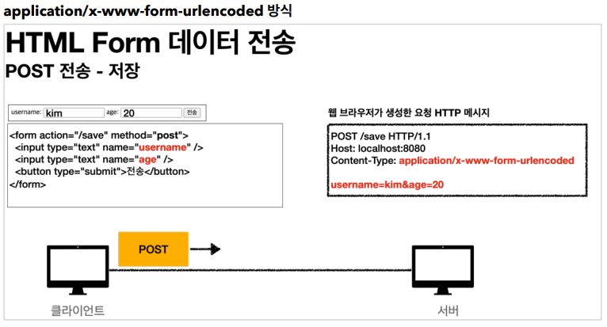
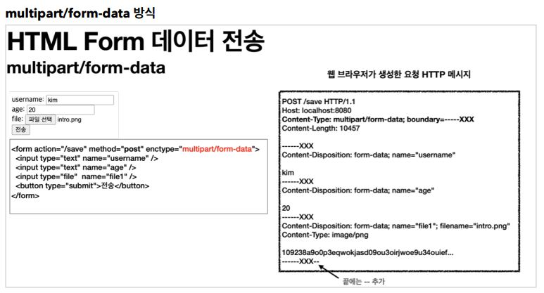

# 파일 업로드

일반적으로 사용하는 HTML Form 을 통한 파일 업로드를 이해하려면 먼저 폼을 전송하는 다음 두 가지 방식의 차이를 이해해야 한다.

- __HTML Form 전송 방식__
  - application/x-www-form-urlencoded
  - multipart/form-data



`application/x-www-form-urlencoded` 방식은 HTML 폼 데이터를 서버로 전송하는 가장 기본적인 방식이다. Form 태그에 별도의 `enctype` 옵션이 없으면
웹 브라우저는 요청 HTTP 메시지 헤더에 다음 내용을 추가한다.

`Content-Type: application/x-www-form-urlencoded`

그리고 폼에 입력한 전송할 항목을 HTTP Body 에 문자로 username=kim&age=20 과  같이 `&`로 구분해서 전송한다.

파일을 업로드 하려면 문자가 아니라 `바이너리 데이터`전송해야 를 한다. 문자를 전송하는 `application/x-www-form-urlencoded` 방식으로는 파일을 전송하기 어렵다.
하지만 Form 데이터를 전송할 때 보통 `바이너리+문자`를 다 전송해야 하기 때문에 이러한 문제를 해결하고자 HTTP 는 `multipart/form-data` 방식을 제공한다.



 방식을 사용하려면 Form 태그에 별도의 `enctype="multipart/form-data"` 를 지정해야 한다.

폼의 입력 결과로 생성된 HTTP 메시지를 보면 각각의 전송 항목이 구분이 되어있다. `Content-Disposition` 이라는 항목별 헤더가 추가되어 있고 여기에 부가 정보가 있다. 예제에서는 username,
age, file1 이 각각 분리되어 있고, 폼의 일반 데이터는 각 항목별로 문자가 전송되고, 파일의 경우 파일 이름과 Content-Type이 추가되고 바이너리 데이터가 전송된다.

## 멀티파트 사용 옵션

- 업로드 사이즈 제한

```yml
spring.servlet.multipart.max-file-size=1MB
spring.servlet.multipart.max-request-size=10MB
```
큰 파일을 무제한 업로드하게 둘 수는 없으므로 업로드 사이즈를 제한할 수 있다.
사이즈를 넘으면 예외(`SizeLimitExceededException`)가 발생한다.

- max-file-size : 파일 하나의 최대 사이즈, 기본 1MB
- max-request-size : 멀티파트 요청 하나에 여러 파일을 업로드 할 수 있는데, 그 전체 합이다. 기본 10MB

- spring.servlet.multipart.enabled 끄기
  - spring.servlet.multipart.enabled=false
  - spring.servlet.multipart.enabled 옵션을 끄면 서블릿 컨테이너는 멀티파트와 관련된 처리를 하지 않는다.
  - 스프링 부트에서 Default 는 `true` 이다.

## 서블릿과 파일 업로드

서블릿에서는 파일 업로드를 위해 `Part` 라는 것을 제공한다.

- 경로 설정

```yml
file.dir = 파일 업로드 경로 (Ex. /Users/dope/study/file/)
```

경로 마지막에 `/(슬래시)` 포함

```java
@Slf4j
@Controller
@RequestMapping("/servlet/v2")
public class ServletUploadControllerV2 {

    @Value("${file.dir}")
    private String fileDir;

    @GetMapping("/upload")
    public String newFile() {
        return "upload-form";
    }

    @PostMapping("/upload")
    public String saveFileV1(HttpServletRequest request) throws ServletException, IOException {
        log.info("request={}", request);

        String itemName = request.getParameter("itemName");
        log.info("itemName={}", itemName);

        Collection<Part> parts = request.getParts();
        log.info("parts={}", parts);

        for (Part part : parts) {
            log.info("==== PART ====");
            log.info("name={}", part.getName());
            Collection<String> headerNames = part.getHeaderNames();
            for (String headerName : headerNames) {
                log.info("header {}: {}", headerName, part.getHeader(headerName));
            }
            // 편의 메서드
            //content-disposition; filename
            log.info("submittedFilename={}", part.getSubmittedFileName());
            log.info("size={}", part.getSize()); //part body size

            // 데이터 읽기
            InputStream inputStream = part.getInputStream();
            String body = StreamUtils.copyToString(inputStream, StandardCharsets.UTF_8);
            log.info("body={}", body);

            // 파일에 저장하기
            if (StringUtils.hasText(part.getSubmittedFileName())) {
                String fullPath = fileDir + part.getSubmittedFileName();
                log.info("파일 저장 fullPath={}", fullPath);
                part.write(fullPath);
            }
        }

        return "upload-form";
    }
}
```

멀티파트 형식은 전송 데이터를 하나하나 각각 부분(Part)으로 나누어 전송한다. parts 에는 이렇게
나누어진 데이터가 각각 담긴다. 서블릿이 제공하는 Part 는 멀티파트 형식을 편리하게 읽을 수 있는 다양한 메서드를 제공한다.

- __Part 주요 메서드__
  - part.getSubmittedFileName() : 클라이언트가 전달한 파일명
  - part.getInputStream() : Part 의 전송 데이터를 읽을 수 있다.
  - part.write(...) : Part 를 통해 전송된 데이터를 저장할 수 있다.

- 결과 로그

```
==== PART ====
name=itemName
header content-disposition: form-data; name="itemName"
submittedFileName=null
size=7
body=상품A
==== PART ====
name=file
header content-disposition: form-data; name="file"; filename="스크린샷.png"
header content-type: image/png
submittedFileName=스크린샷.png
size=112384
body=qwlkjek2ljlese...
파일 저장 fullPath=/Users/kimyounghan/study/file/스크린샷.png
```

## 스프링과 파일 업로드

스프링은 `MultipartFile` 이라는 인터페이스로 멀티파트 파일을 매우 편리하게 지원한다.

```java
@Slf4j
@Controller
@RequestMapping("/spring")
public class SpringUploadController {

    @Value("${file.dir}")
    private String fileDir;

    @GetMapping("/upload")
    public String newFile() {
        return "upload-form";
    }

    @PostMapping("/upload")
    public String saveFile(@RequestParam String itemName,
                           @RequestParam MultipartFile file, 
                           HttpServletRequest request) throws IOException {
        log.info("request={}", request);
        log.info("itemName={}", itemName);
        log.info("multipartFile={}", file);

        if (!file.isEmpty()) {
            String fullPath = fileDir + file.getOriginalFilename();
            log.info("파일 저장 fullPath={}", fullPath);
            file.transferTo(new File(fullPath));
        }

        return "upload-form";
    }
}
```

@RequestParam MultipartFile file
업로드하는 HTML Form의 name에 맞추어 @RequestParam 을 적용하면 된다. 추가로
@ModelAttribute 에서도 MultipartFile 을 동일하게 사용할 수 있다.

- __MultipartFile 주요 메서드__
  - file.getOriginalFileName() : 업로드 파일명
  - file.transferTo(...) : 파일 저장

- 결과 로그

```
request=org.springframework.web.multipart.support.StandardMultipartHttpServletR
equest@5c022dc6
itemName=상품A
multipartFile=org.springframework.web.multipart.support.StandardMultipartHttpSe
rvletRequest$StandardMultipartFile@274ba730
파일 저장 fullPath=/Users/kimyounghan/study/file/스크린샷.png
```

## [예제](https://github.com/BAEKJungHo/springmvc-project2/tree/main/upload/src/main/java/hello/upload)

```java
@Data
public class UploadFile {

    private String uploadFileName;
    private String storeFileName;

    public UploadFile(String uploadFileName, String storeFileName) {
        this.uploadFileName = uploadFileName;
        this.storeFileName = storeFileName;
    }
}
```

```java
@Component
public class FileStore {

    @Value("${file.dir}")
    private String fileDir;

    public String getFullPath(String filename) {
        return fileDir + filename;
    }

    public List<UploadFile> storeFiles(List<MultipartFile> multipartFiles) throws IOException {
        List<UploadFile> storeFileResult = new ArrayList<>();
        for (MultipartFile multipartFile : multipartFiles) {
            if (!multipartFile.isEmpty()) {
                storeFileResult.add(storeFile(multipartFile));
            }
        }
        return storeFileResult;
    }

    public UploadFile storeFile(MultipartFile multipartFile) throws IOException {
        if (multipartFile.isEmpty()) {
            return null;
        }

        String originalFilename = multipartFile.getOriginalFilename();
        String storeFileName = createStoreFileName(originalFilename);
        multipartFile.transferTo(new File(getFullPath(storeFileName)));
        return new UploadFile(originalFilename, storeFileName);
    }

    private String createStoreFileName(String originalFilename) {
        String ext = extractExt(originalFilename);
        String uuid = UUID.randomUUID().toString();
        return uuid + "." + ext;
    }

    private String extractExt(String originalFilename) {
        int pos = originalFilename.lastIndexOf(".");
        return originalFilename.substring(pos + 1);
    }

}
```

```java
@PostMapping("/items/new")
public String saveItem(@ModelAttribute ItemForm form, RedirectAttributes redirectAttributes) throws IOException {
    UploadFile attachFile = fileStore.storeFile(form.getAttachFile());
    List<UploadFile> storeImageFiles = fileStore.storeFiles(form.getImageFiles());

    //데이터베이스에 저장
    Item item = new Item();
    item.setItemName(form.getItemName());
    item.setAttachFile(attachFile);
    item.setImageFiles(storeImageFiles);
    itemRepository.save(item);

    redirectAttributes.addAttribute("itemId", item.getId());

    return "redirect:/items/{itemId}";
}
```

